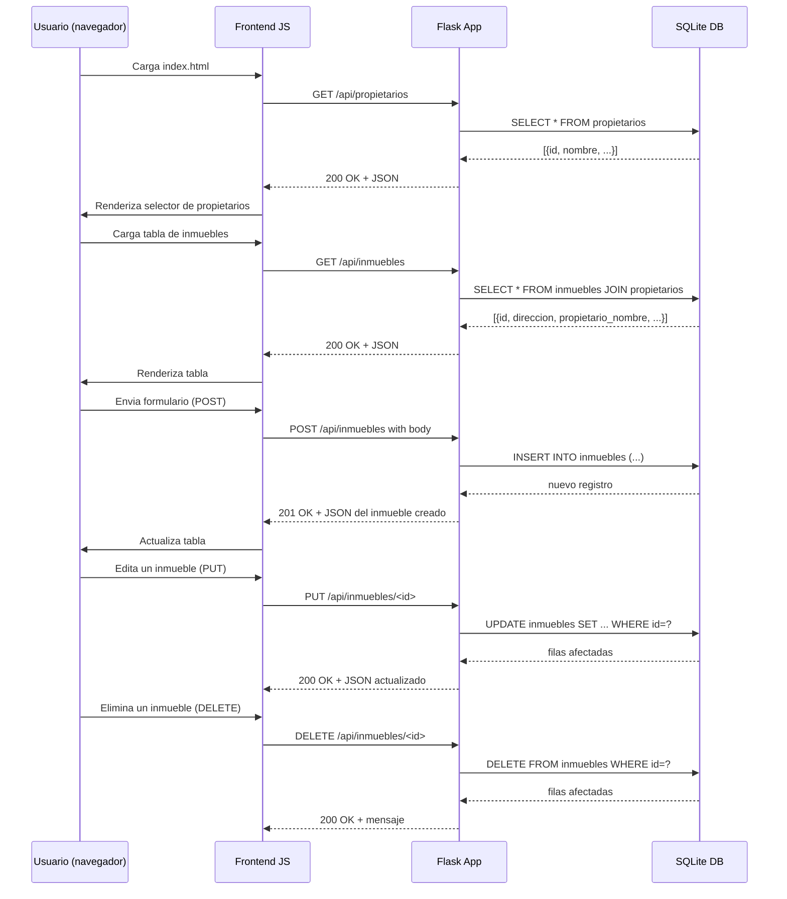

# Visión General del Proyecto

Mini‑AirBnB es una **aplicación de gestión inmobiliaria** que permite crear, leer, actualizar y eliminar inmuebles (propiedades) y listar propietarios. El backend está construido con **Flask**, usando SQLAlchemy para la capa ORM y SQLite como base de datos. La interfaz de usuario se sirve como un SPA ligera en `frontend/index.html`, consumiendo una API RESTful.

El flujo típico es:
1. El cliente solicita `/api/inmuebles` o `/api/propietarios`.
2. Flask devuelve JSON con los registros.
3. El front‑end renderiza tablas y permite CRUD mediante modales Bootstrap.

---

# Arquitectura del Sistema

## Componentes Principales
| Componente | Descripción |
|------------|-------------|
| **Flask App** | Punto de entrada (`app.py`). Configura rutas, blueprints y manejo de errores. |
| **Blueprint API** | `backend/routes.py` expone endpoints `/api/inmuebles`, `/api/propietarios`. |
| **Modelo ORM** | `backend/models.py`: tres tablas – `Propietario`, `Inmueble`, `Inquilino`. Relación 1‑N entre propietario e inmueble y 1‑1 entre inmueble e inquilino. |
| **Base de Datos** | SQLite (`inmobiliaria.db`). Configurado en `create_app()`. |
| **Frontend** | `frontend/index.html` con Bootstrap, JavaScript puro para consumir la API. |

## Diagrama de Componentes (Mermaid)

```mermaid
graph TD
    A[Cliente Web] -->|HTTP| B[Flask App]
    B --> C[API Blueprint]
    C --> D[SQLAlchemy ORM]
    D --> E[SQLite DB]
    B --> F[Static Files (index.html)]
```

---

# Endpoints de la API

## Tabla de Endpoints

| Método | Ruta | Descripción | Parámetros | Respuesta |
|--------|------|-------------|------------|-----------|
| `GET` | `/api/inmuebles` | Lista todos los inmuebles con datos del propietario. | N/A | 200: `[ {inmueble} ]` |
| `POST` | `/api/inmuebles` | Crea un nuevo inmueble. | JSON `{direccion, ciudad, tipo, precio_alquiler?, disponible?, propietario_id?}` | 201: `{inmueble}` |
| `PUT` | `/api/inmuebles/<int:id>` | Actualiza campos de un inmueble existente. | JSON con cualquier campo actualizable. | 200: `{inmueble}` |
| `DELETE` | `/api/inmuebles/<int:id>` | Elimina un inmueble. | N/A | 200: `{message}` |
| `GET` | `/api/propietarios` | Lista todos los propietarios. | N/A | 200: `[ {propietario} ]` |

### Ejemplo de Respuesta de Inmueble

```json
{
  "id": 1,
  "direccion": "Calle Falsa 123",
  "ciudad": "Madrid",
  "tipo": "Piso",
  "precio_alquiler": 1200.5,
  "disponible": true,
  "propietario_id": 2,
  "propietario_nombre": "Juan Pérez"
}
```

---

# Instrucciones de Instalación y Ejecución

1. **Clonar el repositorio**  
   ```bash
   git clone https://github.com/tuusuario/miniairbnb.git
   cd miniairbnb
   ```

2. **Crear entorno virtual (opcional pero recomendado)**  
   ```bash
   python -m venv .venv
   source .venv/bin/activate  # Windows: .venv\Scripts\activate
   ```

3. **Instalar dependencias**  
   ```bash
   pip install -r requirements.txt
   ```

4. **Inicializar la base de datos** (se crea automáticamente al arrancar)  
   ```bash
   python app.py
   ```
   La aplicación se ejecutará en `http://127.0.0.1:5000/`.

5. **Ejecutar pruebas unitarias**  
   ```bash
   pytest tests/test_api.py
   ```

---

# Flujo de Datos Clave



---

# Extensiones Futuras

| Área | Posible Mejora |
|------|----------------|
| **Autenticación** | Añadir JWT o sesiones para proteger endpoints CRUD. |
| **Relaciones Inquilino‑Inmueble** | Implementar CRUD completo de inquilinos y asignación a inmuebles. |
| **Paginación & Filtros** | Agregar parámetros `?page=1&size=20` y filtros por ciudad, tipo o precio. |
| **Documentación Swagger/OpenAPI** | Generar documentación automática con Flask‑RESTX o FastAPI. |
| **Frontend SPA** | Migrar a React/Vue para mayor interactividad y manejo de estado. |

---