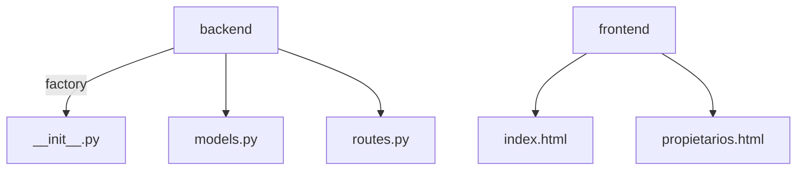

# Visión General del Proyecto

Este proyecto es una aplicación web sencilla de **gestión inmobiliaria** que permite administrar *propietarios*, *inmuebles* y, en futuro, *inquilinos*. Se compone de dos capas principales:

- **Backend (Python/Flask)**: expone una API RESTful con endpoints para crear, leer, actualizar y eliminar inmuebles, además de listar propietarios. Utiliza SQLite como base de datos y SQLAlchemy como ORM.
- **Frontend (HTML/CSS/JavaScript puro)**: un SPA minimalista que consume la API del backend y ofrece interfaces para visualizar y manipular los registros directamente desde el navegador.

El proyecto está pensado para ser desplegado en un entorno local, con una única dependencia externa (`Flask`) y sus complementos (`Flask-SQLAlchemy`). La arquitectura sigue el patrón **MVC** simplificado: los modelos están definidos en `backend/models.py`, las rutas en `backend/routes.py` y la lógica de negocio en el factory `backend/__init__.py`.

---

# Arquitectura del Sistema

## 1. Estructura de Paquetes



- `backend/__init__.py`: crea la aplicación Flask, configura la base de datos y registra los blueprints.
- `backend/models.py`: define las tablas `Propietario`, `Inmueble` e `Inquilino`.
- `backend/routes.py`: contiene dos blueprints (`inmuebles_bp`, `propietarios_bp`) que exponen los endpoints REST.
- `frontend/`: archivos estáticos servidos por Flask.

## 2. Base de Datos

| Tabla | Campos Principales | Relaciones |
|-------|--------------------|------------|
| **Propietario** | id, nombre, email (único), telefono | One-to-Many → Inmueble |
| **Inmueble** | id, direccion, ciudad, tipo, precio_alquiler, disponible, propietario_id | Many-to-One ← Propietario |
| **Inquilino** | id, nombre, email (único), inmueble_alquilado_id | Many-to-One ← Inmueble |

> **Nota:** La tabla `Inquilino` está definida pero no expuesta aún a través de la API.

## 3. Flujo de Datos

1. El cliente envía una solicitud HTTP al endpoint `/api/inmuebles`.
2. Flask recibe la petición, valida los datos y crea un objeto `Inmueble`.
3. SQLAlchemy persiste el registro en SQLite.
4. La respuesta JSON incluye la representación completa del inmueble, con su propietario anidado.

---

# Endpoints de la API

| Método | Ruta | Descripción | Parámetros (JSON) | Respuesta |
|--------|------|-------------|-------------------|-----------|
| **GET** | `/api/inmuebles` | Lista todos los inmuebles. | — | `[{inmueble}]` |
| **POST** | `/api/inmuebles` | Crea un nuevo inmueble. | `direccion`, `ciudad`, `tipo`, `propietario_id`, opcionales: `precio_alquiler`, `disponible` | `201 Created` + objeto creado |
| **PUT** | `/api/inmuebles/<id>` | Actualiza campos de un inmueble existente. | Cualquier combinación de los campos anteriores | `200 OK` + objeto actualizado |
| **DELETE** | `/api/inmuebles/<id>` | Elimina el inmueble con id dado. | — | `200 OK` + mensaje de éxito |
| **GET** | `/api/propietarios` | Lista todos los propietarios. | — | `[{propietario}]` |

> **Ejemplo de respuesta Inmueble:**
```json
{
  "id": 1,
  "direccion": "Calle Falsa 123",
  "ciudad": "Madrid",
  "tipo": "Piso",
  "precio_alquiler": 800.0,
  "disponible": true,
  "propietario_id": 5,
  "propietario": {
    "id": 5,
    "nombre": "Juan",
    "email": "juan@example.com",
    "telefono": null
  }
}
```

---

# Instrucciones de Instalación y Ejecución

1. **Clonar el repositorio**  
   ```bash
   git clone https://github.com/tuusuario/inmobiliaria.git
   cd inmobiliaria
   ```

2. **Crear entorno virtual (opcional pero recomendado)**  
   ```bash
   python -m venv venv
   source venv/bin/activate  # Windows: venv\Scripts\activate
   ```

3. **Instalar dependencias**  
   ```bash
   pip install -r requirements.txt
   ```

4. **Inicializar la base de datos (SQLite)**  
   La primera ejecución crea automáticamente `inmobiliaria.db`.  
   Si quieres limpiar y recrear:  
   ```bash
   flask shell
   >>> from backend import db, create_app
   >>> app = create_app()
   >>> with app.app_context():
   ...     db.drop_all()
   ...     db.create_all()
   ```

5. **Ejecutar la aplicación**  
   ```bash
   python -m backend
   ```
   O bien:
   ```bash
   export FLASK_APP=backend/__init__.py
   flask run
   ```

6. **Acceder a la UI**  
   Navega a `http://127.0.0.1:5000/` para ver la lista de inmuebles y usar el formulario.

7. **Ejecutar pruebas**  
   ```bash
   pytest tests/test_backend.py
   ```

---

# Flujo de Datos Clave

```mermaid
sequenceDiagram
    participant User as Navegador
    participant Frontend as index.html
    participant Backend as Flask API
    participant DB as SQLite

    User->>Frontend: Solicita /index.html
    Frontend->>Backend: GET /
    Backend-->>Frontend: index.html (static)
    User->>Frontend: Carga JS
    Frontend->>Backend: GET /api/propietarios
    Backend->>DB: SELECT * FROM propietarios
    DB-->>Backend: Resultados
    Backend-->>Frontend: JSON de propietarios
    Frontend->>Frontend: Rellenar <select>
    Frontend->>Backend: GET /api/inmuebles
    Backend->>DB: SELECT * FROM inmuebles JOIN propietarios
    DB-->>Backend: Resultados con propietario anidado
    Backend-->>Frontend: JSON de inmuebles
    Frontend->>Frontend: Renderizar tabla

    User->>Frontend: Envía formulario crear inmueble
    Frontend->>Backend: POST /api/inmuebles (JSON)
    Backend->>DB: INSERT INTO inmuebles (...)
    DB-->>Backend: OK
    Backend-->>Frontend: JSON del nuevo inmueble
    Frontend->>Frontend: Actualizar tabla
```



---

# Extensiones Futuras

| Área | Posible Mejora | Justificación |
|------|----------------|---------------|
| **API** | Endpoints CRUD para `Propietario` e `Inquilino`. | Completar la funcionalidad de gestión de usuarios. |
| **Autenticación** | JWT o sesiones basadas en Flask-Login. | Restringir operaciones sensibles a usuarios autenticados. |
| **Validaciones** | WTForms / Marshmallow para validación avanzada. | Mejorar la robustez y la claridad de los errores. |
| **Frontend** | Migrar a un framework (React/Vue) o usar HTMX. | Facilitar componentes reutilizables y mejorar UX. |
| **Persistencia** | Cambiar a PostgreSQL en producción. | Escalar y aprovechar características avanzadas de SQL. |

---