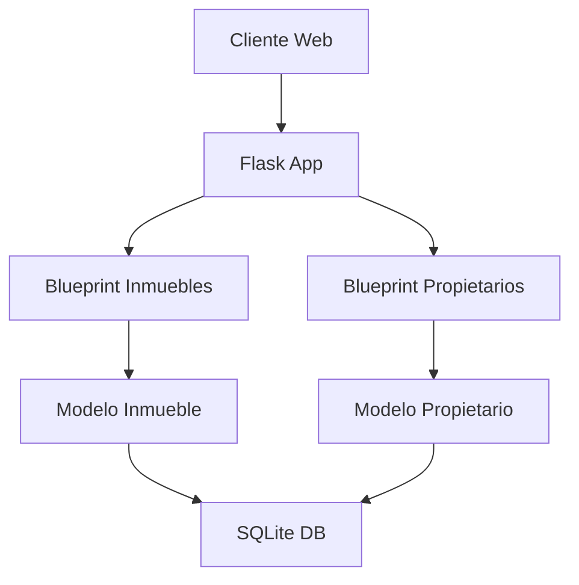
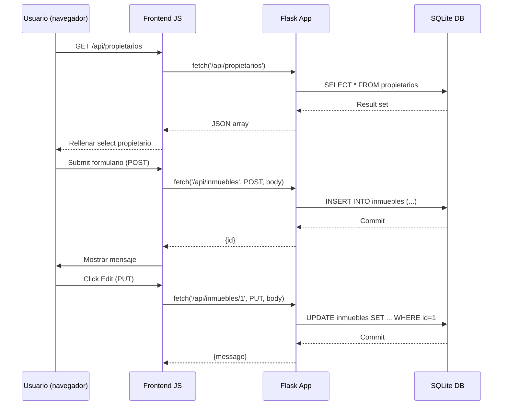

# Visión General del Proyecto
Este proyecto es una **aplicación de gestión inmobiliaria** construida con Flask y SQLAlchemy. Su objetivo principal es permitir a los usuarios crear, leer, actualizar y eliminar inmuebles (propiedades) asociados a propietarios. La interfaz web está servida desde el directorio `frontend` y se comunica con la API RESTful que expone el backend.

- **Backend**: Flask + SQLAlchemy, con modelos para `Propietario`, `Inmueble` e `Inquilino`.  
- **Frontend**: Una página HTML sencilla con JavaScript puro que consume la API.  
- **Persistencia**: SQLite (`inmobiliaria.db`).  
- **Pruebas**: Pytest para validar los endpoints de inmuebles.

El flujo típico es:
1. El cliente (navegador) solicita `/api/inmuebles` o `/api/propietarios`.  
2. Flask ejecuta las consultas, construye JSON y lo devuelve.  
3. El frontend actualiza la tabla y permite CRUD a través de formularios.

# Arquitectura del Sistema
La arquitectura sigue un patrón **MVC** simplificado:

| Componente | Responsabilidad |
|------------|-----------------|
| **Modelos** (`backend/__init__.py`) | Definen las tablas `Propietario`, `Inmueble` e `Inquilino`. Relación: 1‑N entre propietario e inmueble. |
| **Blueprints** (`inmuebles.py`, `propietarios.py`) | Agrupan rutas relacionadas con inmuebles y propietarios respectivamente. |
| **Factory** (`create_app`) | Configura Flask, registra blueprints y crea la base de datos. |
| **Frontend** (`frontend/index.html`) | Interfaz de usuario que consume la API mediante fetch. |



# Endpoints de la API
| Método | Ruta | Descripción | Parámetros | Respuesta |
|--------|------|-------------|------------|-----------|
| **GET** | `/api/inmuebles` | Lista todos los inmuebles con propietario. | N/A | `200 OK`, JSON array |
| **POST** | `/api/inmuebles` | Crea un nuevo inmueble. | `direccion`, `ciudad`, `tipo` (obligatorios); `precio_alquiler`, `disponible`, `propietario_id` opcionales | `201 Created`, `{id}` |
| **PUT** | `/api/inmuebles/<int:id>` | Actualiza campos de un inmueble. | Cualquier campo del modelo | `200 OK`, `{message}` |
| **DELETE** | `/api/inmuebles/<int:id>` | Elimina un inmueble. | N/A | `200 OK`, `{message}` |
| **GET** | `/api/propietarios` | Lista todos los propietarios. | N/A | `200 OK`, JSON array |

## Ejemplo de respuesta GET /api/inmuebles
```json
[
  {
    "id": 1,
    "direccion": "Calle Falsa 123",
    "ciudad": "Madrid",
    "tipo": "Piso",
    "precio_alquiler": 1200.0,
    "disponible": true,
    "propietario": {
      "id": 1,
      "nombre": "Juan"
    }
  }
]
```

# Instrucciones de Instalación y Ejecución
1. **Clonar el repositorio**  
   ```bash
   git clone https://github.com/tu-usuario/inmobiliaria.git
   cd inmobiliaria
   ```

2. **Crear entorno virtual (opcional pero recomendado)**  
   ```bash
   python -m venv venv
   source venv/bin/activate  # Windows: venv\Scripts\activate
   ```

3. **Instalar dependencias**  
   ```bash
   pip install -r requirements.txt
   ```

4. **Inicializar la base de datos** (se hace automáticamente al arrancar la app)  

5. **Ejecutar la aplicación**  
   ```bash
   python app.py
   ```
   La API estará disponible en `http://127.0.0.1:5000/api` y el frontend en `http://127.0.0.1:5000/`.

6. **Ejecutar pruebas unitarias**  
   ```bash
   pytest tests/test_backend.py
   ```

# Flujo de Datos Clave


# Extensiones Futuras
- **Autenticación y autorización**: Implementar JWT para proteger los endpoints.  
- **Gestión de inquilinos**: Añadir CRUD completo similar a inmuebles.  
- **Filtrado y paginación**: En `/api/inmuebles` permitir parámetros `?ciudad=...&tipo=Piso&page=2`.  
- **Frontend React/Vue**: Reemplazar el JS puro por un SPA con manejo de estado más robusto.  
- **Dockerización**: Crear Dockerfile y docker-compose para despliegue reproducible.

---