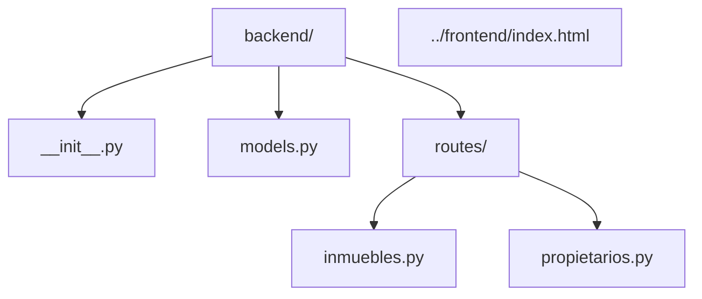
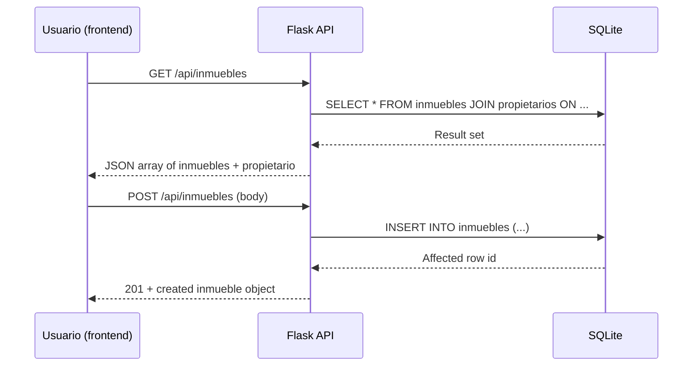

# Visión General del Proyecto
El proyecto es una **aplicación de gestión inmobiliaria** desarrollada con Flask y SQLAlchemy. Su objetivo principal es permitir la administración de propietarios (`Propietario`), inmuebles disponibles para alquiler (`Inmueble`) e inquilinos (`Inquilino`). La capa de persistencia utiliza SQLite, mientras que la API REST expone endpoints simples para consultar y manipular los recursos principales.

El flujo típico de uso se resume en:
1. **Registrar un propietario** (a través del frontend o directamente insertando datos en la base).
2. **Añadir inmuebles** vinculados a ese propietario.
3. **Consultar inmuebles** con información anidada del propietario.
4. **Actualizar o eliminar inmuebles** según sea necesario.

La arquitectura sigue el patrón *Model–View–Controller* simplificado, donde:
- **Models**: `Propietario`, `Inmueble` e `Inquilino`.
- **Views/Controllers**: Blueprints de Flask (`inmuebles_bp`, `propietarios_bp`) que manejan la lógica de negocio y serialización.
- **Templates**: Un único archivo estático `index.html` servido por Flask.

---

# Arquitectura del Sistema
## Estructura de Paquetes



## Base de Datos (SQLite)
| Tabla | Campos | Tipo | Restricciones |
|-------|--------|------|---------------|
| `propietarios` | `id`, `nombre`, `email`, `telefono` | Integer, String, String, String | PK, unique(email) |
| `inmuebles` | `id`, `direccion`, `ciudad`, `tipo`, `precio_alquiler`, `disponible`, `propietario_id` | Integer, String, String, String, Float, Boolean, Integer | PK, FK(propietarios.id), default(disponible=true) |
| `inquilinos` | `id`, `nombre`, `email`, `inmueble_alquilado_id` | Integer, String, String, Integer | PK, unique(email), FK(inmuebles.id) |

---

# Endpoints de la API
## Tabla de Endpoints

| Método | Ruta | Descripción | Parámetros | Respuesta |
|--------|------|-------------|------------|-----------|
| `GET`  | `/api/propietarios` | Lista todos los propietarios | Ninguno | JSON array de objetos propietario |
| `GET`  | `/api/inmuebles` | Lista inmuebles con datos del propietario | Ninguno | JSON array de objetos inmueble (incluye propietario) |
| `POST` | `/api/inmuebles` | Crea un nuevo inmueble | Body JSON (`direccion`, `ciudad`, `tipo`, `precio_alquiler`, `propietario_id`) | 201 + objeto inmueble creado |
| `PUT`  | `/api/inmuebles/<id>` | Actualiza campos de un inmueble | URL param `id`; Body JSON con cualquier campo editable | 200 + objeto actualizado |
| `DELETE`| `/api/inmuebles/<id>` | Elimina un inmueble | URL param `id` | 200 + mensaje confirmación |

## Ejemplos de Peticiones

```bash
# Obtener todos los inmuebles
curl -X GET http://localhost:5000/api/inmuebles

# Crear nuevo inmueble
curl -X POST http://localhost:5000/api/inmuebles \
     -H "Content-Type: application/json" \
     -d '{"direccion":"Calle Falsa 123","ciudad":"Madrid","tipo":"Departamento","precio_alquiler":1200.5,"propietario_id":1}'
```

---

# Instrucciones de Instalación y Ejecución
1. **Clonar el repositorio**  
   ```bash
   git clone https://github.com/tu_usuario/inmobiliaria.git
   cd inmobiliaria/backend
   ```

2. **Crear entorno virtual (opcional pero recomendado)**  
   ```bash
   python3 -m venv venv
   source venv/bin/activate  # Windows: venv\Scripts\activate
   ```

3. **Instalar dependencias**  
   ```bash
   pip install -r requirements.txt
   ```

4. **Inicializar la base de datos** (solo una vez)  
   ```python
   >>> from backend import create_app, db
   >>> app = create_app()
   >>> with app.app_context():
   ...     db.create_all()
   ```

5. **Ejecutar el servidor Flask**  
   ```bash
   flask run --host=0.0.0.0 --port=5000
   ```
   La aplicación estará disponible en `http://localhost:5000/`.

---

# Flujo de Datos Clave


---

# Extensiones Futuras (Opcional)
- **Gestión de Inquilinos**  
  Añadir endpoints CRUD para `Inquilino` y asociar contratos de alquiler.
- **Autenticación JWT**  
  Implementar seguridad con tokens para proteger los endpoints sensibles.
- **Pagos en Línea**  
  Integrar pasarelas como Stripe o PayPal para el cobro del alquiler.
- **Notificaciones por Email**  
  Enviar recordatorios automáticos a propietarios e inquilinos cuando se acerque la fecha de pago.

---