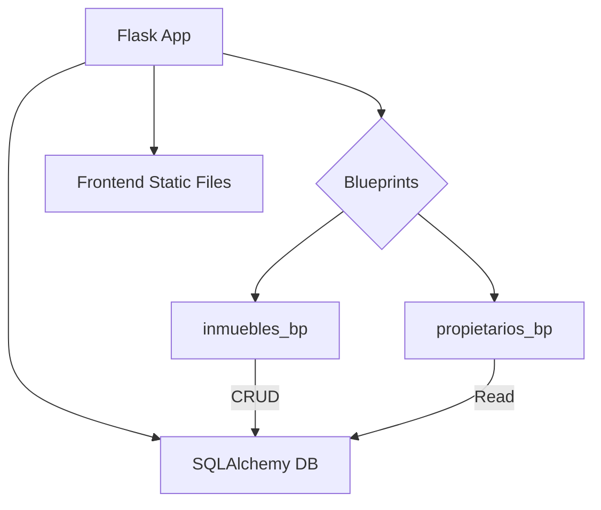
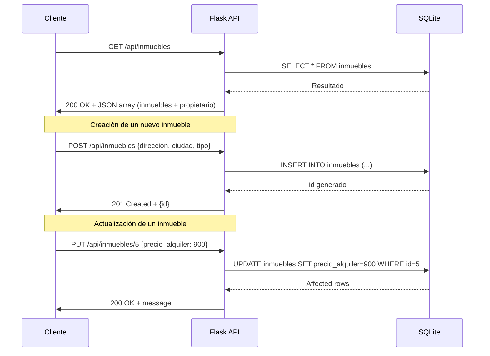

# Visión General del Proyecto

El proyecto es una **aplicación web de gestión inmobiliaria** desarrollada con **Flask** y **SQLAlchemy**, que permite administrar propiedades (`Inmueble`) y sus propietarios (`Propietario`). La capa de presentación se sirve desde un directorio `frontend` (no incluido en el volcado), mientras que la lógica de negocio y la API están implementadas como blueprints bajo `/api`. El esquema de datos es sencillo pero completo: cada inmueble puede estar asociado a un propietario, y los propietarios pueden tener múltiples inmuebles. Además, se define una tabla para inquilinos (`Inquilino`), aunque no está expuesta por la API actual.

El flujo típico de uso:
1. **Propietarios** son creados y listados mediante el endpoint `/api/propietarios`.
2. **Inmuebles** pueden crearse, actualizarse, eliminarse o consultarse a través de los endpoints `/api/inmuebles`. Cada inmueble incluye información del propietario asociado.
3. La base de datos es SQLite (`inmobiliaria.db`) y se crea automáticamente al arrancar la aplicación.

---

# Arquitectura del Sistema

## Componentes Principales
| Componente | Descripción |
|------------|-------------|
| **Flask App** | Punto de entrada, configura la base de datos y registra blueprints. |
| **SQLAlchemy ORM** | Modelo relacional con tres tablas: `Propietario`, `Inmueble`, `Inquilino`. |
| **Blueprints** | `inmuebles_bp` y `propietarios_bp` exponen los endpoints REST bajo `/api`. |
| **Frontend Static Files** | Servidos desde la carpeta `../frontend` mediante `send_static_file`. |

## Diagrama de Componentes (Mermaid)



---

# Endpoints de la API

## Propietarios

| Método | Ruta | Parámetros | Descripción |
|--------|------|------------|-------------|
| `GET`  | `/api/propietarios` | ninguno | Lista todos los propietarios. |
| **Respuesta** | 200 OK | JSON array con `{id, nombre, email, telefono}` |

## Inmuebles

| Método | Ruta | Parámetros | Descripción |
|--------|------|------------|-------------|
| `GET`  | `/api/inmuebles` | ninguno | Lista todos los inmuebles junto con su propietario. |
| **Respuesta** | 200 OK | JSON array con `{id, direccion, ciudad, tipo, precio_alquiler, disponible, propietario: {id, nombre}}` |
| `POST` | `/api/inmuebles` | JSON body (`direccion`, `ciudad`, `tipo`; opcionales `precio_alquiler`, `disponible`, `propietario_id`) | Crea un nuevo inmueble. |
| **Respuesta** | 201 Created | `{id}` |
| `PUT` | `/api/inmuebles/<int:id>` | JSON body con campos a actualizar | Actualiza el inmueble especificado. |
| **Respuesta** | 200 OK | `{message: 'Inmueble updated'}` |
| `DELETE` | `/api/inmuebles/<int:id>` | ninguno | Elimina el inmueble. |
| **Respuesta** | 200 OK | `{message: 'Inmueble deleted'}` |

### Ejemplo de Payload para POST

```json
{
  "direccion": "Calle Falsa 123",
  "ciudad": "Madrid",
  "tipo": "Piso",
  "precio_alquiler": 850.0,
  "disponible": true,
  "propietario_id": 1
}
```

---

# Instrucciones de Instalación y Ejecución

1. **Clonar el repositorio**  
   ```bash
   git clone https://github.com/tu_usuario/inmobiliaria.git
   cd inmobiliaria
   ```

2. **Crear un entorno virtual (opcional pero recomendado)**  
   ```bash
   python3 -m venv venv
   source venv/bin/activate  # En Windows: venv\Scripts\activate
   ```

3. **Instalar dependencias**  
   ```bash
   pip install -r requirements.txt
   ```
   *Si no existe `requirements.txt`, instala manualmente:*  
   ```bash
   pip install Flask==2.3.3 flask_sqlalchemy==3.1.0
   ```

4. **Inicializar la base de datos**  
   La primera vez que arranques la app, se crea automáticamente `inmobiliaria.db`. No es necesario ejecutar nada extra.

5. **Ejecutar la aplicación**  
   ```bash
   export FLASK_APP=app.py  # o el nombre del archivo donde está create_app()
   flask run
   ```
   La API estará disponible en `http://127.0.0.1:5000/api/`.

6. **Acceder al frontend**  
   Navega a `http://127.0.0.1:5000/` para cargar la interfaz estática.

---

# Flujo de Datos Clave



---

# Extensiones Futuras

| Área | Posible Mejora |
|------|----------------|
| **Autenticación** | Implementar JWT o OAuth para proteger los endpoints. |
| **Gestión de Inquilinos** | Exponer CRUD para `Inquilino` y relacionarlo con inmuebles alquilados. |
| **Filtros y Paginación** | Añadir query params (`?ciudad=...&tipo=Piso`) y paginación en GET `/api/inmuebles`. |
| **Validaciones Avanzadas** | Usar Marshmallow o Pydantic para validar y serializar datos de entrada. |
| **Pruebas Unitarias** | Integrar PyTest con tests de integración para la API. |
| **Dockerización** | Crear Dockerfile y docker-compose para despliegue reproducible. |

---