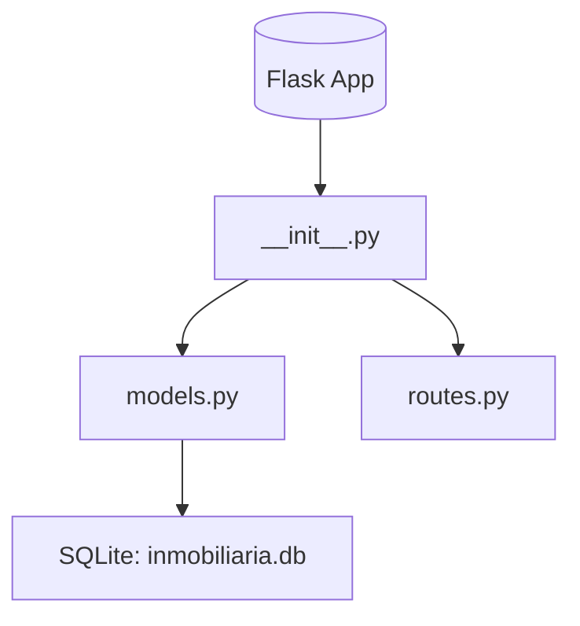
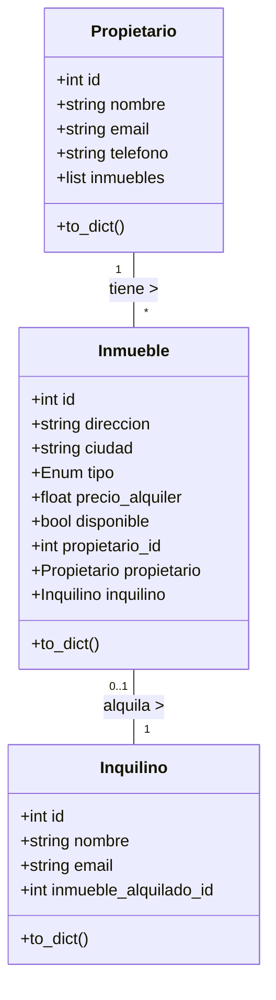
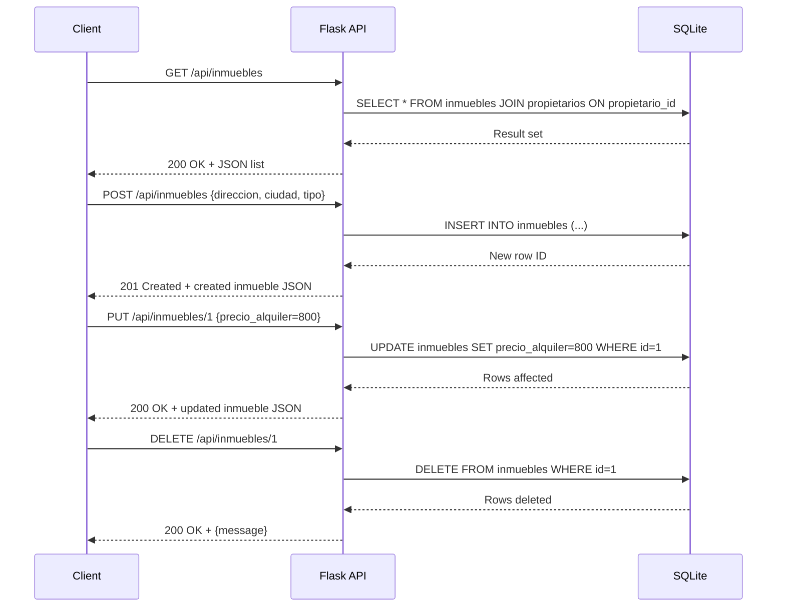

# Visión General del Proyecto

El proyecto es una API RESTful desarrollada con **Flask** y **SQLAlchemy**, diseñada para gestionar un sistema de alquiler de inmuebles. Se centra en tres entidades principales:

- **Propietario**: representa a los dueños de las propiedades, con campos como nombre, email y teléfono.
- **Inmueble**: describe cada propiedad disponible para alquilar, incluyendo dirección, ciudad, tipo (Piso, Casa o Local), precio, disponibilidad y referencia al propietario.
- **Inquilino**: almacena información sobre el usuario que alquila una propiedad, vinculándose a un inmueble concreto.

La API expone endpoints bajo `/api` que permiten listar, crear, actualizar y eliminar inmuebles, además de consultar propietarios. La aplicación utiliza SQLite como base de datos y Flask-Migrate para la gestión de migraciones.

---

# Arquitectura del Sistema

## Estructura de Paquetes



- **`__init__.py`**: fábrica de la aplicación (`create_app`) que configura Flask, SQLAlchemy y Migrate. Registra el blueprint `api_bp`.
- **`models.py`**: define los modelos ORM con relaciones bidireccionales entre propietarios e inmuebles, y entre inmuebles e inquilinos.
- **`routes.py`**: contiene todas las rutas de la API bajo el blueprint `/api`. Incluye helpers para manejo de errores.

## Diagrama de Clases



---

# Endpoints de la API

## Tabla de Rutas

| Método | Ruta | Descripción | Parámetros | Cuerpo (JSON) | Respuesta |
|--------|------|-------------|------------|---------------|-----------|
| GET | `/api/inmuebles` | Lista todos los inmuebles con datos del propietario. | None | None | `200 OK` → `[{inmueble}]` |
| POST | `/api/inmuebles` | Crea un nuevo inmueble. | None | `{direccion, ciudad, tipo, precio_alquiler?, disponible?, propietario_id?}` | `201 Created` → `inmueble` |
| PUT | `/api/inmuebles/<int:inmueble_id>` | Actualiza un inmueble existente. | `inmueble_id` | `{direccion?, ciudad?, tipo?, precio_alquiler?, disponible?, propietario_id?}` | `200 OK` → `inmueble` |
| DELETE | `/api/inmuebles/<int:inmueble_id>` | Elimina un inmueble. | `inmueble_id` | None | `200 OK` → `{message}` |
| GET | `/api/propietarios` | Lista todos los propietarios. | None | None | `200 OK` → `[ {propietario} ]` |

### Ejemplo de respuesta para Inmueble

```json
{
  "id": 1,
  "direccion": "Calle Falsa 123",
  "ciudad": "Madrid",
  "tipo": "Piso",
  "precio_alquiler": 750.0,
  "disponible": true,
  "propietario_id": 2,
  "propietario_nombre": "Juan Pérez"
}
```

---

# Instrucciones de Instalación y Ejecución

1. **Clonar el repositorio**  
   ```bash
   git clone https://github.com/tuusuario/inmobiliaria-backend.git
   cd inmobiliaria-backend
   ```

2. **Crear un entorno virtual (opcional pero recomendado)**  
   ```bash
   python3 -m venv venv
   source venv/bin/activate  # En Windows: venv\Scripts\activate
   ```

3. **Instalar dependencias**  
   ```bash
   pip install -r requirements.txt
   ```

4. **Inicializar la base de datos**  
   ```bash
   flask db init          # Si se usan migraciones
   flask db migrate
   flask db upgrade
   ```

5. **Ejecutar la aplicación**  
   ```bash
   export FLASK_APP=backend  # Ajusta según el nombre del paquete
   flask run
   ```
   La API estará disponible en `http://127.0.0.1:5000/api`.

---

# Flujo de Datos Clave



---

# Extensiones Futuras (Opcional)

- **Endpoints para Inquilinos**: CRUD completo similar al de inmuebles.
- **Autenticación y autorización**: JWT o Flask‑Login para proteger rutas sensibles.
- **Filtrado avanzado**: Búsqueda por ciudad, tipo, rango de precio y disponibilidad.
- **Paginar resultados**: `limit` y `offset` en las consultas GET.
- **Notificaciones**: Enviar email al propietario cuando un inmueble es alquilado o liberado.