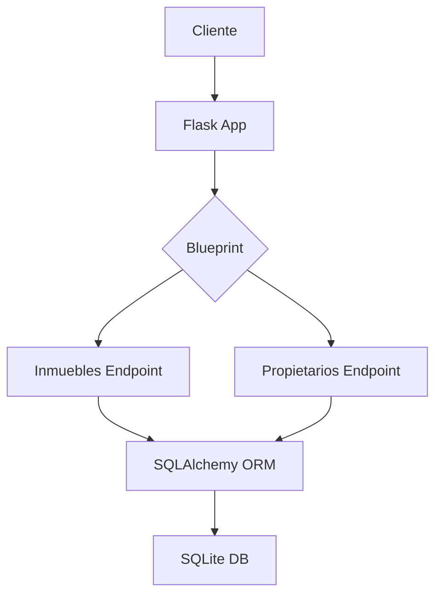

# Visión General del Proyecto
Este proyecto es una API RESTful sencilla construida con **Flask** y **SQLAlchemy**, diseñada para gestionar un sistema de inmobiliaria.  
- **Objetivo principal:** Permitir la creación, lectura, actualización y eliminación (CRUD) de inmuebles, además de listar propietarios asociados a cada inmueble.  
- **Persistencia:** Utiliza una base de datos SQLite (`inmobiliaria.db`) con tres tablas: `propietarios`, `inmuebles` e `inquilinos`.  
- **Estructura del código:**  
  - `models.py`: Define los modelos ORM y sus relaciones.  
  - `routes.py`: Contiene los endpoints de la API agrupados en dos blueprints (`inmuebles_bp` y `propietarios_bp`).  
  - `__init__.py`: Factory que crea la aplicación Flask, configura la base de datos, registra los blueprints y expone la instancia de SQLAlchemy.  

El flujo de trabajo típico es: el cliente envía una petición HTTP a `/api/inmuebles` o `/api/propietarios`, el servidor procesa la lógica en `routes.py`, accede a la base de datos mediante los modelos y devuelve un JSON con la respuesta.

---

# Arquitectura del Sistema
La arquitectura sigue un patrón **MVC** simplificado:

| Componente | Responsabilidad |
|------------|-----------------|
| **Flask App** | Orquesta las rutas, gestiona errores y sirve el frontend estático. |
| **Blueprints** (`inmuebles_bp`, `propietarios_bp`) | Agrupan endpoints relacionados, manteniendo la modularidad. |
| **SQLAlchemy ORM** | Traduce objetos Python a filas SQL y viceversa. |
| **SQLite DB** | Almacena datos de propietarios, inmuebles e inquilinos. |

## Diagrama Mermaid


---

# Endpoints de la API

## Tabla de Endpoints

| Método | Ruta | Descripción | Parámetros de Entrada | Respuesta |
|--------|------|-------------|-----------------------|-----------|
| `GET`  | `/api/inmuebles` | Lista todos los inmuebles. | Ninguno | Array JSON de objetos inmueble. |
| `POST` | `/api/inmuebles` | Crea un nuevo inmueble. | JSON con `direccion`, `ciudad`, `tipo`, `propietario_id` (obligatorios). Opcionales: `precio_alquiler`, `disponible`. | Objeto JSON del inmueble creado, `201 Created`. |
| `PUT`  | `/api/inmuebles/<id>` | Actualiza un inmueble existente. | JSON con cualquier campo actualizable (`direccion`, `ciudad`, `tipo`, `precio_alquiler`, `disponible`, `propietario_id`). | Objeto JSON actualizado. |
| `DELETE` | `/api/inmuebles/<id>` | Elimina un inmueble. | Ninguno | Mensaje de confirmación, `200 OK`. |
| `GET`  | `/api/propietarios` | Lista todos los propietarios. | Ninguno | Array JSON de objetos propietario. |

### Ejemplo de Payload para crear un Inmueble
```json
{
  "direccion": "Calle Falsa 123",
  "ciudad": "Springfield",
  "tipo": "Departamento",
  "propietario_id": 1,
  "precio_alquiler": 750.0,
  "disponible": true
}
```

---

# Instrucciones de Instalación y Ejecución

1. **Clonar el repositorio**  
   ```bash
   git clone https://github.com/tuusuario/inmobiliaria.git
   cd inmobiliaria
   ```

2. **Crear un entorno virtual (opcional pero recomendado)**  
   ```bash
   python3 -m venv venv
   source venv/bin/activate   # En Windows: venv\Scripts\activate
   ```

3. **Instalar dependencias**  
   ```bash
   pip install -r requirements.txt
   ```

4. **Inicializar la base de datos**  
   ```bash
   flask shell
   >>> from inmobiliaria import create_app
   >>> app = create_app()
   >>> with app.app_context():
   ...     app.db.create_all()
   ... 
   ```

5. **Ejecutar la aplicación**  
   ```bash
   export FLASK_APP=inmobiliaria
   flask run --host=0.0.0.0 --port=5000
   ```
   La API estará disponible en `http://localhost:5000/api/`.

---

# Flujo de Datos Clave

1. **Creación de Inmueble**  
   - Cliente envía POST a `/api/inmuebles`.  
   - Flask recibe JSON → valida campos obligatorios.  
   - Se crea instancia `Inmueble` y se añade al session.  
   - Commit → SQLAlchemy genera INSERT en SQLite.  
   - Respuesta con objeto JSON del inmueble creado.

2. **Actualización de Inmueble**  
   - Cliente envía PUT a `/api/inmuebles/<id>`.  
   - Flask recupera el registro con `query.get_or_404(id)`.  
   - Se actualizan los atributos presentes en el payload.  
   - Commit → UPDATE en SQLite.

3. **Borrado de Inmueble**  
   - Cliente envía DELETE a `/api/inmuebles/<id>`.  
   - Flask recupera y elimina el registro.  
   - Commit → DELETE en SQLite.

4. **Listar Propietarios**  
   - Cliente envía GET a `/api/propietarios`.  
   - Se ejecuta `Propietario.query.all()` → SELECT de todos los propietarios.  
   - Respuesta JSON con lista de propietarios, cada uno sin datos de inmuebles (relación lazy).

---

# Extensiones Futuras

- **Endpoints para Inquilinos**: CRUD completo y asociación con inmuebles alquilados.  
- **Autenticación JWT**: Protección de rutas sensibles (crear/editar/borrar).  
- **Paginar resultados**: Añadir parámetros `page` y `per_page`.  
- **Validaciones más estrictas**: Uso de Marshmallow o Pydantic para schemas.  
- **Migraciones con Alembic**: Facilitar cambios futuros en el esquema de la base de datos.  

---