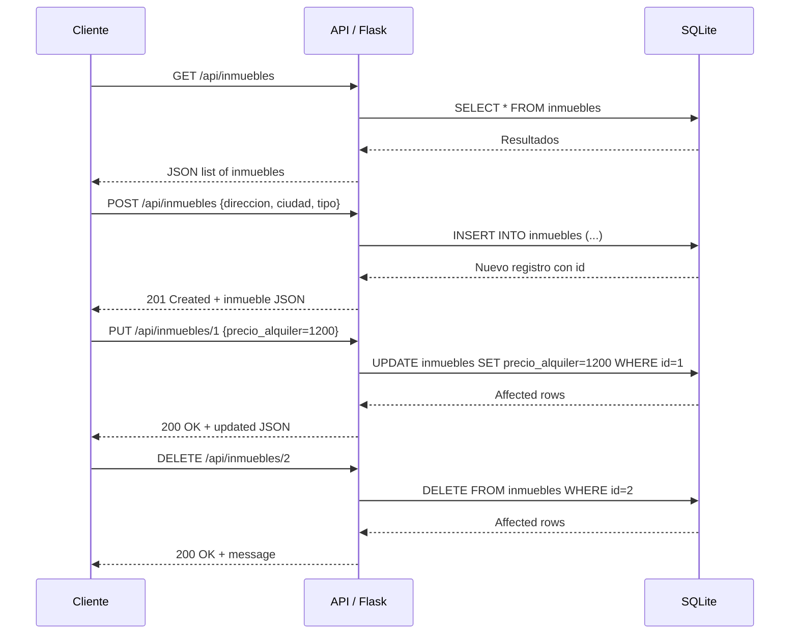

# Visión General del Proyecto
Este proyecto es una API RESTful sencilla para gestionar un portal inmobiliario.  
El backend está construido con **Flask** y utiliza **SQLAlchemy** como ORM sobre una base de datos SQLite (`inmobiliaria.db`). La aplicación expone endpoints para crear, leer, actualizar y eliminar inmuebles, así como listar propietarios. Los modelos principales son:

- **Propietario**: representa a los dueños de los inmuebles.
- **Inmueble**: describe cada propiedad con su dirección, ciudad, tipo (Piso/Casa/Local), precio de alquiler y disponibilidad.
- **Inquilino**: vincula un usuario que alquila un inmueble.

El flujo típico es:
1. Se inicializa la base de datos mediante `init_db.py`.
2. La aplicación escucha en `/api` con los endpoints definidos en `routes.py`.
3. El front‑end (ubicado en `frontend/`) sirve la página principal y consume la API.

# Arquitectura del Sistema
```mermaid
graph TD
    A[Flask App] -->|Registers| B(API Blueprint)
    B --> C{Endpoints}
    C --> D[/api/inmuebles]
    C --> E[/api/propietarios]
    subgraph Database
        F[SQLite: inmobiliaria.db]
    end
    D -.-> F
    E -.-> F
```

## Componentes Clave
| Componente | Descripción |
|------------|-------------|
| **Flask App** | Punto de entrada (`create_app`). Configura la base de datos, registra blueprints y maneja errores. |
| **SQLAlchemy (db)** | ORM que gestiona las tablas `propietarios`, `inmuebles` e `inquilinos`. |
| **Blueprint API** | Agrupa todas las rutas bajo `/api`. |
| **Modelo Propietario** | Tabla `propietarios`: id, nombre, email, teléfono. |
| **Modelo Inmueble** | Tabla `inmuebles`: id, dirección, ciudad, tipo (Enum), precio_alquiler, disponible, propietario_id. |
| **Modelo Inquilino** | Tabla `inquilinos`: id, nombre, email, inmueble_alquilado_id. |

# Endpoints de la API
## 1. Inmuebles

| Método | Ruta | Parámetros | Descripción | Respuesta (ejemplo) |
|--------|------|------------|-------------|---------------------|
| **GET** | `/api/inmuebles` | ninguno | Lista todos los inmuebles. | `200 OK`: `[{"id":1,"direccion":"Calle A","ciudad":"Madrid",...}]` |
| **POST** | `/api/inmuebles` | JSON (`direccion`, `ciudad`, `tipo`, opcionales `precio_alquiler`, `disponible`, `propietario_id`) | Crea un nuevo inmueble. | `201 Created`: `{"id":2,"direccion":"Calle B",...}` |
| **PUT** | `/api/inmuebles/<int:id>` | JSON (cualquier campo editable) | Actualiza el inmueble con ID dado. | `200 OK`: `{"id":1,...}` |
| **DELETE** | `/api/inmuebles/<int:id>` | ninguno | Elimina el inmueble con ID dado. | `200 OK`: `{"message":"Inmueble deleted successfully"}` |

## 2. Propietarios

| Método | Ruta | Parámetros | Descripción | Respuesta (ejemplo) |
|--------|------|------------|-------------|---------------------|
| **GET** | `/api/propietarios` | ninguno | Lista todos los propietarios. | `200 OK`: `[{"id":1,"nombre":"Juan","email":"juan@example.com",...}]` |

# Instrucciones de Instalación y Ejecución
1. **Clonar el repositorio**  
   ```bash
   git clone <url_del_repositorio>
   cd <directorio_del_proyecto>
   ```

2. **Crear un entorno virtual**  
   ```bash
   python3 -m venv venv
   source venv/bin/activate  # En Windows: venv\Scripts\activate
   ```

3. **Instalar dependencias**  
   ```bash
   pip install -r requirements.txt
   ```

4. **Inicializar la base de datos**  
   ```bash
   python init_db.py
   ```

5. **Ejecutar la aplicación**  
   ```bash
   export FLASK_APP=backend  # o set FLASK_APP=backend en Windows
   flask run
   ```
   La API estará disponible en `http://127.0.0.1:5000/api`.

6. **Acceder al front‑end (opcional)**  
   Si el directorio `frontend` contiene un `index.html`, se servirá automáticamente bajo la ruta raíz `/`.

# Flujo de Datos Clave


# Extensiones Futuras (Opcional)
- **Endpoints de Inquilinos**: CRUD completo para gestionar usuarios que alquilan propiedades.
- **Autenticación y Autorización**: JWT o OAuth2 para proteger los endpoints sensibles.
- **Filtrado y Paginación**: Parámetros `?ciudad=...&tipo=Piso` y paginación (`page`, `per_page`) en la lista de inmuebles.
- **Validaciones Avanzadas**: Uso de Marshmallow o Pydantic para validar y serializar datos entrantes.
- **Migraciones de Base de Datos**: Integrar Flask-Migrate para manejar cambios estructurales sin perder datos.