# Visión General del Proyecto

Gestión de Inmuebles es una aplicación web ligera que permite administrar propiedades y sus propietarios a través de una interfaz de usuario sencilla basada en HTML, CSS y JavaScript puro. La arquitectura sigue un patrón cliente‑servidor donde el frontend consume una API RESTful expuesta por un backend (no incluido en los archivos proporcionados). El proyecto está pensado para ser desplegado como un conjunto de páginas estáticas que se comunican con un servicio externo a través del prefijo `/api`.

El flujo típico es:
1. **Carga inicial**: Al abrir `index.html` o `propietarios.html`, el script hace una petición GET a `/api/propietarios` y `/api/inmuebles` para poblar los formularios y tablas.
2. **Operaciones CRUD**: Los formularios permiten crear, leer, actualizar y eliminar registros mediante POST, PUT y DELETE sobre los endpoints correspondientes.
3. **Interacción dinámica**: Se usan modales y prompts para editar datos sin recargar la página.

El proyecto se centra en la usabilidad y simplicidad; no emplea frameworks modernos (React/Vue) ni herramientas de build, lo que facilita su despliegue directo en cualquier servidor estático.

---

# Arquitectura del Sistema

## Estructura de Archivos
| Archivo | Descripción |
|---------|-------------|
| `index.html` | Página principal para listar y gestionar inmuebles. Incluye tabla, formularios y modal de edición. |
| `propietarios.html` | Página para listar y gestionar propietarios. Incluye tabla y formulario de creación. |
| `apiBase = '/api'` | Prefijo usado por los scripts para acceder a la API RESTful. |

## Diagrama Mermaid

```mermaid
graph TD
    A[Cliente (Browser)] -->|GET /api/propietarios| B(API Server)
    A -->|GET /api/inmuebles| B
    A -->|POST /api/inmuebles| B
    A -->|PUT /api/inmuebles/:id| B
    A -->|DELETE /api/inmuebles/:id| B
    A -->|POST /api/propietarios| B
    A -->|PUT /api/propietarios/:id| B
    A -->|DELETE /api/propietarios/:id| B
```

La comunicación es **solo HTTP**; los datos se envían y reciben en formato JSON. Los scripts manejan errores mostrando alertas al usuario.

---

# Endpoints de la API

| Método | Ruta | Descripción | Parámetros de Consulta | Cuerpo (JSON) |
|--------|------|-------------|-----------------------|---------------|
| `GET` | `/api/propietarios` | Lista todos los propietarios. | N/A | N/A |
| `POST` | `/api/propietarios` | Crea un nuevo propietario. | N/A | `{ nombre, email?, telefono? }` |
| `PUT` | `/api/propietarios/:id` | Actualiza el nombre del propietario (solo se permite nombre). | N/A | `{ nombre }` |
| `DELETE` | `/api/propietarios/:id` | Elimina un propietario. | N/A | N/A |
| `GET` | `/api/inmuebles` | Lista todos los inmuebles con sus propietarios. | N/A | N/A |
| `POST` | `/api/inmuebles` | Crea un nuevo inmueble. | N/A | `{ direccion, ciudad, tipo, precio_alquiler?, disponible, propietario_id }` |
| `PUT` | `/api/inmuebles/:id` | Actualiza un inmueble completo. | N/A | `{ id, direccion, ciudad, tipo, precio_alquiler?, disponible, propietario_id }` |
| `DELETE` | `/api/inmuebles/:id` | Elimina un inmueble. | N/A | N/A |

> **Nota**: La API debe devolver respuestas con el encabezado `Content-Type: application/json`. Los códigos de estado HTTP estándar (`200`, `201`, `204`, `400`, `404`) son recomendados.

---

# Instrucciones de Instalación y Ejecución

1. **Clonar o descargar el repositorio**  
   ```bash
   git clone https://github.com/tuusuario/gestion-inmuebles.git
   cd gestion-inmuebles
   ```

2. **Servir las páginas estáticas**  
   Puedes usar cualquier servidor HTTP simple, por ejemplo:

   - **Python 3.x**  
     ```bash
     python -m http.server 8000
     ```
   - **Node.js (http-server)**  
     ```bash
     npx http-server -p 8000
     ```

3. **Acceder a la aplicación**  
   Navega en tu navegador a `http://localhost:8000/index.html` o `propietarios.html`.

4. **Configurar el backend**  
   Asegúrate de que exista un servicio escuchando bajo `/api`. Si usas un servidor local, configura un proxy para redirigir esas rutas al backend correspondiente.

---

# Flujo de Datos Clave

```mermaid
sequenceDiagram
    participant User as Usuario
    participant Browser as Navegador
    participant API as Servidor API

    User->>Browser: Abre index.html
    Browser->>API: GET /api/propietarios
    API-->>Browser: 200 OK + JSON propietarios
    Browser->>Browser: Llenar <select id="propSelect">
    
    Browser->>API: GET /api/inmuebles
    API-->>Browser: 200 OK + JSON inmuebles
    Browser->>Browser: Renderizar tabla de inmuebles
    
    User->>Browser: Rellena y envía formulario "Añadir Inmueble"
    Browser->>API: POST /api/inmuebles (JSON)
    API-->>Browser: 201 Created + JSON nuevo inmueble
    Browser->>Browser: Resetear formulario y recargar tabla
    
    User->>Browser: Hace clic en "Editar" de un inmueble
    Browser->>API: GET /api/inmuebles
    API-->>Browser: 200 OK + JSON inmuebles
    Browser->>Browser: Prellenar modal con datos del inmueble
    Browser->>User: Modal abierto
    
    User->>Browser: Modifica y envía formulario de edición
    Browser->>API: PUT /api/inmuebles/:id (JSON)
    API-->>Browser: 200 OK + JSON actualizado
    Browser->>Browser: Cerrar modal y recargar tabla
```



- **Propietarios** se cargan una sola vez al inicio; su lista se reutiliza en los formularios de inmuebles.
- Los **inmuebles** siempre se obtienen con la relación `propietario` para mostrar el nombre del propietario.

---

# Extensiones Futuras (Opcional)

1. **Autenticación y Roles**  
   - Añadir JWT o sesiones para proteger los endpoints `/api/*`.  
   - Diferenciar roles: administrador, agente, cliente.

2. **Validaciones Avanzadas**  
   - Validar formatos de email/telefono en el frontend antes del envío.  
   - Validar precios y disponibilidad en el backend.

3. **Paginación y Búsqueda**  
   - Implementar parámetros `?page=` y `?search=` en los GETs para manejar grandes volúmenes de datos.

4. **Framework Frontend**  
   - Migrar a React/Vue con componentes reutilizables, mejorando la experiencia de usuario (tabla paginada, filtros dinámicos).

5. **Persistencia Local**  
   - Cachear resultados con `localStorage` para reducir llamadas al servidor cuando el usuario navega entre páginas.

6. **Pruebas Automatizadas**  
   - Añadir tests unitarios/funcionales con Jest y Cypress para garantizar la estabilidad de las operaciones CRUD.

---