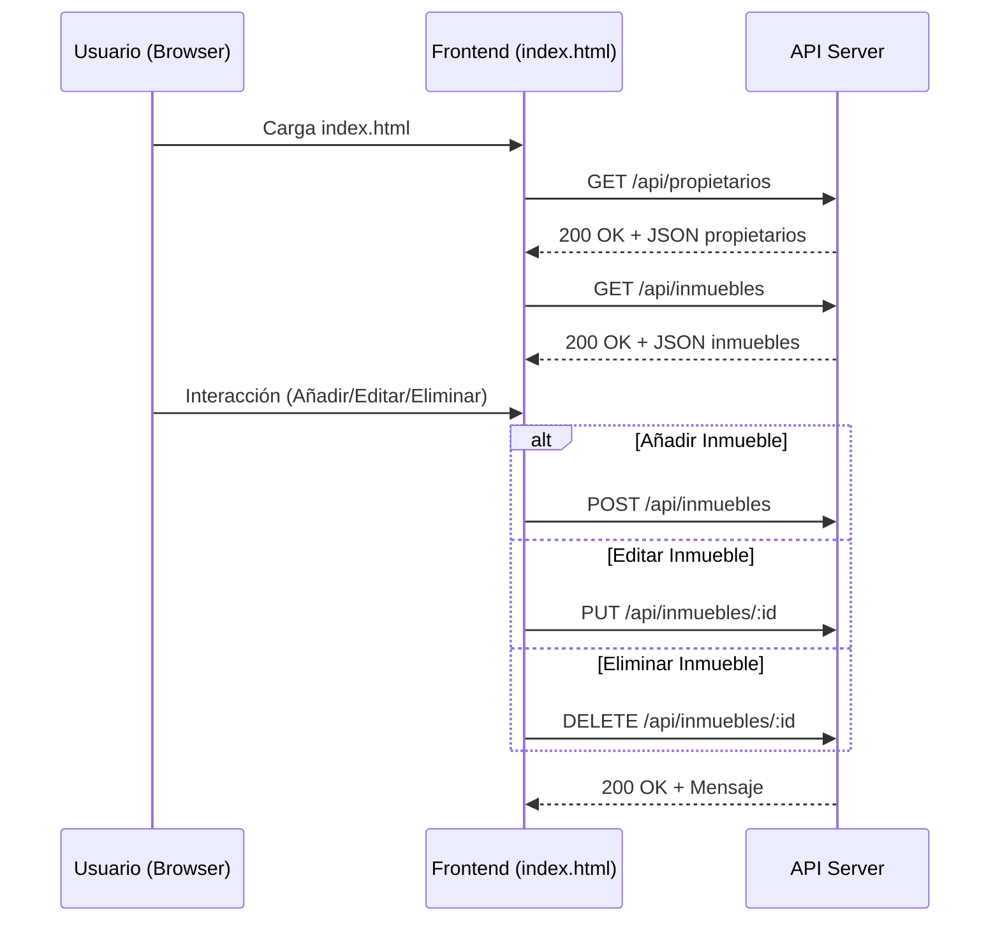

# Visión General del Proyecto

Gestión Inmobiliaria es una aplicación web sencilla que permite administrar inmuebles y sus propietarios.  
El front‑end está construido con HTML, CSS y JavaScript puro; no se requiere ningún framework de UI.  
La comunicación con el servidor se realiza a través de una API RESTful expuesta bajo `/api`.  

Al arrancar la página principal (`index.html`) se cargan:

1. **Propietarios** – Se rellenan los `<select>` para asociar un inmueble a su dueño.
2. **Inmuebles** – Se muestra una tabla con la información esencial: dirección, ciudad, tipo, precio de alquiler, disponibilidad y propietario.

El usuario puede:
- Añadir un nuevo inmueble mediante el formulario.
- Editar o eliminar cualquier registro existente directamente desde la tabla.

---

# Arquitectura del Sistema

```
┌───────────────────────┐
│  Navegador (Cliente) │
└─────────────▲─────────┘
              │ HTTP/JSON
              ▼
┌───────────────────────┐
│   Servidor Web (API)  │
├───────────────────────┤
│  • /api/propietarios  │ GET → Lista de propietarios
│  • /api/inmuebles     │ GET, POST
│  • /api/inmuebles/:id │ PUT, DELETE
└───────────────────────┘
```

## Diagrama Mermaid



---

# Endpoints de la API

| Método | Ruta                 | Descripción                                 | Parámetros de Entrada (JSON)                     | Respuesta (JSON) |
|--------|----------------------|---------------------------------------------|-------------------------------------------------|------------------|
| GET    | `/api/propietarios`  | Lista todos los propietarios                | Ninguno                                         | `[{id, nombre}]`|
| GET    | `/api/inmuebles`     | Lista todos los inmuebles                   | Ninguno                                         | `[{inmueble…}]` |
| POST   | `/api/inmuebles`     | Crea un nuevo inmueble                      | `{direccion, ciudad, tipo, precio_alquiler?, disponible, propietario_id}` | `{"id":<int>, ...}`|
| PUT    | `/api/inmuebles/:id` | Actualiza el inmueble con id dado           | `{direccion, ciudad, tipo, precio_alquiler?, disponible, propietario_id}` | `{"id":<int>, ...}`|
| DELETE | `/api/inmuebles/:id` | Elimina el inmueble con id dado             | Ninguno                                         | `{"message":"eliminado"}`|

> **Nota:** La API devuelve códigos de estado HTTP estándar (`200 OK`, `400 Bad Request`, `404 Not Found`, etc.) y un cuerpo JSON con la información relevante o mensajes de error.

---

# Instrucciones de Instalación y Ejecución

1. **Clonar el repositorio**  
   ```bash
   git clone https://github.com/tu-usuario/gestión-inmobiliaria.git
   cd gestión-inmobiliaria
   ```

2. **Instalar dependencias (si aplica)**  
   La aplicación solo requiere un servidor estático; si usas Node.js con Express:  
   ```bash
   npm install express cors body-parser
   ```

3. **Configurar el backend**  
   Crea un archivo `server.js` con la siguiente configuración mínima:

   ```js
   const express = require('express');
   const app = express();
   const port = 3000;

   app.use(express.static('.'));          // Sirve index.html y JS
   app.use(express.json());

   // Rutas de ejemplo (implementa lógica real)
   let propietarios = [{id:1, nombre:'Juan Pérez'}];
   let inmuebles = [];

   app.get('/api/propietarios', (_, res) => res.json(propietarios));
   app.get('/api/inmuebles', (_, res) => res.json(inmuebles));

   app.post('/api/inmuebles', (req, res) => {
     const newId = inmuebles.length + 1;
     const inmueble = {...req.body, id: newId};
     inmuebles.push(inmueble);
     res.status(201).json(inmueble);
   });

   app.put('/api/inmuebles/:id', (req, res) => {
     const idx = inmuebles.findIndex(i=>i.id==req.params.id);
     if(idx===-1){ return res.status(404).json({message:'No encontrado'});}
     inmuebles[idx] = {...inmuebles[idx], ...req.body};
     res.json(inmuebles[idx]);
   });

   app.delete('/api/inmuebles/:id', (req, res) => {
     inmuebles = inmuebles.filter(i=>i.id!=req.params.id);
     res.json({message:'eliminado'});
   });

   app.listen(port, () => console.log(`Servidor corriendo en http://localhost:${port}`));
   ```

4. **Iniciar el servidor**  
   ```bash
   node server.js
   ```

5. **Abrir la aplicación**  
   Navega a `http://localhost:3000` en tu navegador.

---

# Flujo de Datos Clave

```mermaid
flowchart TD
    A[Usuario] -->|Carga página| B[Browser]
    B --> C{Fetch Propietarios}
    C --> D[API /propietarios]
    D --> E[JSON propietarios]
    E --> F[Rellenar <select>]

    B --> G{Fetch Inmuebles}
    G --> H[API /inmuebles]
    H --> I[JSON inmuebles]
    I --> J[Renderizar tabla]

    subgraph Interacción
        K1[Agregar] -->|POST| L[API /inmuebles]
        K2[Editar] -->|PUT| M[API /inmuebles/:id]
        K3[Eliminar] -->|DELETE| N[API /inmuebles/:id]
    end

    L --> O[Respuesta 201 + JSON]
    M --> P[Respuesta 200 + JSON]
    N --> Q[Respuesta 200 + Mensaje]

    O --> J
    P --> J
    Q --> J
```



- **Carga inicial**: Se obtienen propietarios e inmuebles y se muestran en la interfaz.
- **Operaciones CRUD**: Cada acción del usuario dispara una llamada HTTP correspondiente; el servidor devuelve el estado actualizado, que el front‑end vuelve a renderizar.

---

# Extensiones Futuras

1. **Persistencia real** – Sustituir los arrays in‑memory por una base de datos (PostgreSQL, MongoDB) y usar un ORM/ODM.
2. **Autenticación** – Añadir login con JWT para proteger la API y restringir operaciones a usuarios autenticados.
3. **Validaciones del lado del cliente y servidor** – Garantizar que los campos obligatorios estén completos y que el precio sea positivo.
4. **Filtros y paginación** – En `/api/inmuebles` permitir parámetros `?ciudad=&tipo=&page=` para mejorar rendimiento con grandes volúmenes de datos.
5. **Interfaz móvil responsive** – Optimizar CSS o integrar un framework como Bootstrap para uso en dispositivos móviles.

---