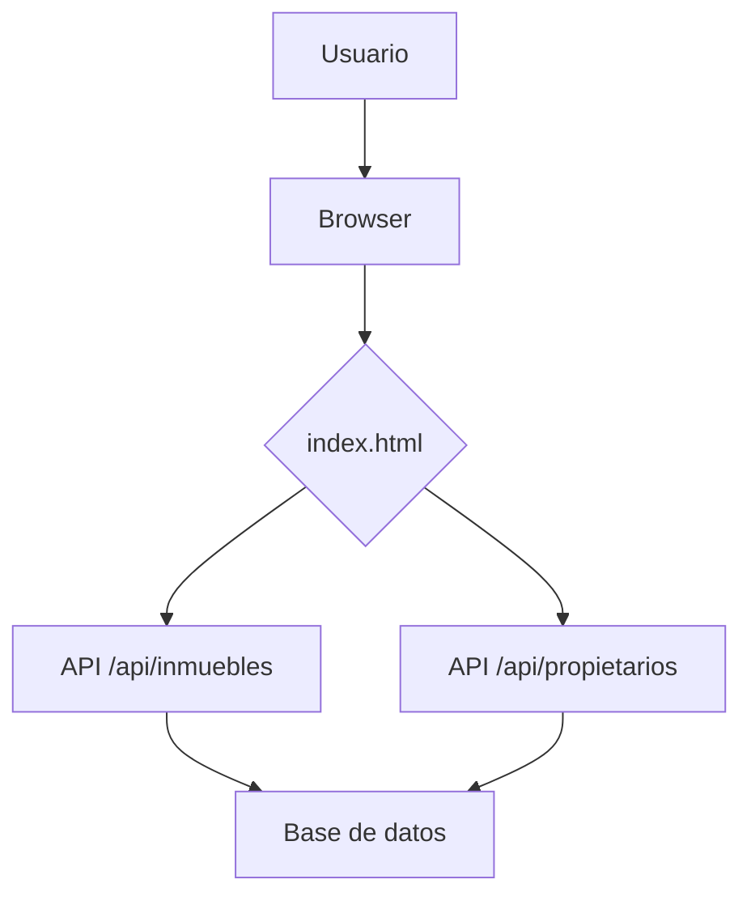
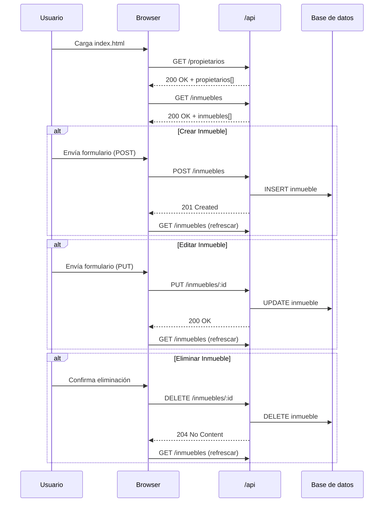

# Visión General del Proyecto

Mini-AirBnB es una aplicación web ligera que permite gestionar inmuebles y propietarios para un servicio de alquiler tipo Airbnb. La interfaz está construida con Bootstrap 5 y JavaScript puro, consumiendo una API RESTful alojada en el mismo dominio bajo la ruta `/api`. El proyecto se centra únicamente en el frontend; los endpoints son simulados o delegados a un back‑end que expone recursos `inmuebles` y `propietarios`.

El flujo típico de uso es:
1. Al cargar la página, se solicitan los propietarios y los inmuebles.
2. Los datos se muestran en una tabla con opciones para crear, editar o eliminar inmuebles.
3. Un modal permite añadir o modificar un inmueble, seleccionando el propietario asociado.

---

# Arquitectura del Sistema

## Estructura de Carpetas (simplificada)

```
/index.html          <-- Página principal
/api                 <-- Endpoints REST simulados (puede ser una carpeta con JSON o un servidor)
```

La aplicación sigue una arquitectura **cliente‑servidor**:

| Componente | Responsabilidad |
|------------|-----------------|
| **Frontend** (`index.html`) | UI, interacción del usuario, consumo de API. |
| **API REST** (`/api/*`) | CRUD sobre `inmuebles` y `propietarios`. |
| **Base de datos** (implícita) | Persistencia de los recursos; no se detalla en el código fuente. |

### Diagrama Mermaid



---

# Endpoints de la API

| Método | Ruta | Parámetros | Descripción |
|--------|------|------------|-------------|
| `GET`  | `/api/inmuebles` | – | Devuelve una lista de inmuebles con sus atributos y el nombre del propietario. |
| `POST` | `/api/inmuebles` | JSON (`direccion`, `ciudad`, `tipo`, `precio_alquiler`, `propietario_id`) | Crea un nuevo inmueble. |
| `PUT`  | `/api/inmuebles/:id` | JSON (misma estructura que POST) | Actualiza el inmueble con ID especificado. |
| `DELETE` | `/api/inmuebles/:id` | – | Elimina el inmueble con ID especificado. |
| `GET`  | `/api/propietarios` | – | Devuelve la lista de propietarios (`id`, `nombre`). |

> **Nota**: Los endpoints están diseñados para responder con JSON y usar los códigos HTTP estándar (200, 201, 204, 400, 404).

---

# Instrucciones de Instalación y Ejecución

1. Clona el repositorio o copia los archivos en un directorio local.  
2. Asegúrate de tener un servidor que sirva la carpeta raíz (`index.html`) y la API `/api`. Puedes usar **Node.js** con Express o cualquier servidor estático + JSON server.  
3. Si usas `json-server`:

   ```bash
   npm install -g json-server
   # Crea un archivo db.json con datos de ejemplo:
   echo '{
     "propietarios": [
       {"id":1,"nombre":"Ana Pérez"},
       {"id":2,"nombre":"Luis Gómez"}
     ],
     "inmuebles": []
   }' > db.json

   json-server --watch db.json --routes routes.json
   ```

4. Abre `index.html` en tu navegador (puede ser a través de `http://localhost:3000/`).  
5. Interactúa con la UI para crear, editar o eliminar inmuebles.

---

# Flujo de Datos Clave



---

# Extensiones Futuras

1. **Autenticación y autorización**  
   - Añadir JWT o sesiones para proteger los endpoints.
2. **Gestión de reservas**  
   - Tabla `reservas` con relaciones `inmueble_id`, `usuario_id`, fechas, etc.
3. **Filtros y paginación**  
   - Mejorar el `GET /inmuebles` con query params (`?ciudad=...&tipo=...`) y paginación (`page`, `limit`).
4. **Interfaz móvil optimizada**  
   - Utilizar Bootstrap responsive o frameworks como Vue/React para una SPA más robusta.
5. **Persistencia real**  
   - Migrar a un back‑end con base de datos SQL/NoSQL (PostgreSQL, MongoDB) y ORM.

---